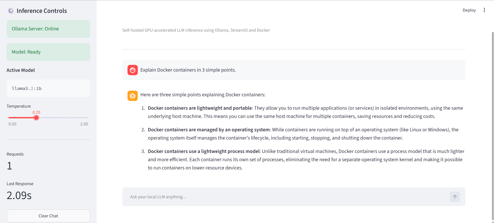
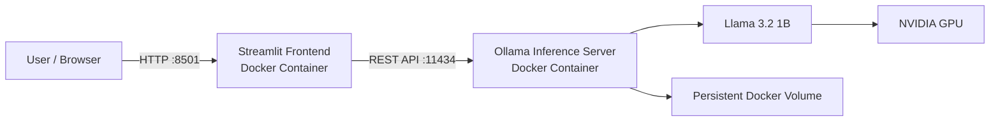
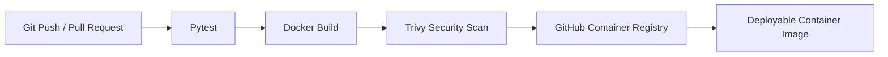

# Containerized LLM Deployment & Inference Platform

[](https://github.com/SWAPKAWALE/containerized-llm-inference-platform/actions/workflows/ci.yml)

A self-hosted, GPU-accelerated Large Language Model inference platform built using **Ollama, Python, Streamlit, Docker, and Docker Compose**.

The project demonstrates how an open-source LLM can be deployed locally without relying on paid APIs or cloud infrastructure while applying practical DevOps practices such as containerization, service health checks, automated testing, CI/CD, security scanning, persistent storage, environment configuration, and container image publishing.

---
## Application Demo



The Streamlit interface shows real-time Ollama server health, model readiness, active model configuration, request metrics, response latency, and streamed LLM responses.

---
## Project Overview

This platform runs an open-source LLM locally using **Ollama** as the inference service and provides an interactive **Streamlit** chat interface.

The frontend communicates with the inference server over Docker's internal network using REST APIs.

The platform currently uses:

```text
Llama 3.2 1B
```

Inference is accelerated using an NVIDIA GPU through Docker GPU support.

---

## Architecture



### Request Flow

```text
Browser
   ↓
Streamlit UI
   ↓
REST API request
   ↓
Ollama inference service
   ↓
Llama 3.2 1B
   ↓
NVIDIA GPU
   ↓
Streaming response
   ↓
Streamlit UI
```

---

## Features

- Self-hosted LLM inference without paid APIs
- GPU-accelerated model execution using Ollama
- Interactive Streamlit chat interface
- Streaming LLM responses
- Multi-turn conversation history
- Configurable inference temperature
- Model availability checks
- Ollama server health monitoring
- Response latency tracking
- Request counter
- Application and inference logging
- Dockerized frontend and inference services
- Docker Compose service orchestration
- Docker internal service-to-service networking
- Persistent model storage using Docker volumes
- Container health checks
- Environment-based configuration
- Automated unit testing with Pytest
- GitHub Actions CI/CD pipeline
- Trivy container vulnerability scanning
- Docker image publishing to GitHub Container Registry

---

## Technology Stack

| Category | Technology |
|---|---|
| LLM Runtime | Ollama |
| Model | Llama 3.2 1B |
| Frontend | Streamlit |
| Programming Language | Python 3.10 |
| API Communication | REST / Requests |
| Containerization | Docker |
| Orchestration | Docker Compose |
| GPU Acceleration | NVIDIA GPU / CUDA |
| Testing | Pytest |
| CI/CD | GitHub Actions |
| Security Scanning | Trivy |
| Container Registry | GitHub Container Registry |
| Version Control | Git / GitHub |

---

## Project Structure

```text
containerized-llm-inference-platform/
│
├── .github/
│   └── workflows/
│       └── ci.yml
│
├── app/
│   ├── Dockerfile
│   ├── .dockerignore
│   ├── __init__.py
│   ├── main.py
│   ├── ollama_client.py
│   └── requirements.txt
│
├── tests/
│   └── test_ollama_client.py
│
├── .env.example
├── .gitignore
├── docker-compose.yml
├── requirements-dev.txt
└── README.md
```

---

## Prerequisites

Before running the project, install:

- Git
- Docker Desktop
- Docker Compose
- NVIDIA GPU drivers
- Docker GPU support
- NVIDIA GPU with sufficient VRAM

The project has been developed and tested using Docker Desktop with WSL2 and NVIDIA GPU acceleration.

You can verify that Docker is running Linux containers with:

```bash
docker info --format "{{.OSType}}"
```

Expected:

```text
linux
```

---

## Verify Docker GPU Access

Before running the LLM, verify that Docker can access your NVIDIA GPU.

For example:

```bash
docker run --rm -it --gpus=all nvcr.io/nvidia/k8s/cuda-sample:nbody nbody -gpu -benchmark
```

The output should detect your NVIDIA GPU.

---

## Getting Started

### 1. Clone the repository

```bash
git clone https://github.com/SWAPKAWALE/containerized-llm-inference-platform.git
```

Move into the project:

```bash
cd containerized-llm-inference-platform
```

---

### 2. Create your environment file

Copy:

```text
.env.example
```

to:

```text
.env
```

On PowerShell:

```powershell
Copy-Item .env.example .env
```

Default configuration:

```env
MODEL_NAME=llama3.2:1b
FRONTEND_PORT=8501
OLLAMA_PORT=11434
```

The `.env` file is intentionally excluded from Git.

---

### 3. Start the Ollama service

```bash
docker compose up -d ollama
```

Check the container:

```bash
docker compose ps
```

---

### 4. Pull the LLM model

The model only needs to be downloaded the first time.

```bash
docker exec -it llm-ollama ollama pull llama3.2:1b
```

Verify it:

```bash
docker exec -it llm-ollama ollama list
```

---

### 5. Start the complete platform

```bash
docker compose up -d --build
```

Check container health:

```bash
docker compose ps
```

Expected:

```text
llm-frontend   Up (healthy)
llm-ollama     Up (healthy)
```

---

### 6. Open the application

Open:

```text
http://localhost:8501
```

You should see the Streamlit LLM chat interface.

---

## Application Interface

The Streamlit frontend provides:

- Ollama server status
- Model readiness status
- Active model information
- Temperature configuration
- Request tracking
- Last-response latency
- Chat history
- Clear-chat control
- Streaming inference responses

---

## Container Networking

Docker Compose automatically creates an internal Docker network.

The frontend does not communicate with Ollama using:

```text
localhost:11434
```

Inside Docker, it uses the service name:

```text
http://ollama:11434
```

This demonstrates service discovery and container-to-container networking.

```text
llm-frontend
      ↓
http://ollama:11434
      ↓
llm-ollama
```

---

## Persistent Model Storage

Ollama model files are stored in a named Docker volume:

```text
ollama_data
```

This prevents downloaded models from disappearing when containers are stopped or recreated.

You can inspect volumes with:

```bash
docker volume ls
```

Stopping containers with:

```bash
docker compose down
```

does not remove the model volume.

---

## Health Checks

Both services include container health checks.

### Ollama

Docker verifies that the Ollama server is operational using:

```text
ollama list
```

### Streamlit

Docker checks Streamlit's internal health endpoint:

```text
http://localhost:8501/_stcore/health
```

This provides a better reliability signal than simply checking whether the container process is running.

---

## Application Logging

The frontend and Ollama client generate logs for important inference events including:

- server health checks
- model availability
- inference request start
- inference completion
- request failures
- invalid responses
- response latency

View frontend logs with:

```bash
docker logs llm-frontend
```

Or follow them live:

```bash
docker logs -f llm-frontend
```

Example:

```text
Ollama server health check successful.
Model llama3.2:1b is available.
Starting inference request using model llama3.2:1b.
Inference request completed.
Inference completed successfully in 5.03 seconds.
```

---

## Automated Testing

The inference API logic is separated from the Streamlit interface to make the application easier to test.

Tests use mocked HTTP requests, meaning the full Ollama server and GPU are not required to execute the unit tests.

Install development dependencies:

```bash
pip install -r requirements-dev.txt
```

Run:

```bash
python -m pytest -v
```

Tests currently validate:

- successful Ollama health checks
- connection failure handling
- streaming response processing

---

# CI/CD Pipeline

The repository contains an automated **GitHub Actions CI/CD pipeline**.



---

## Continuous Integration

For pushes and pull requests targeting `main`, GitHub Actions automatically:

1. Checks out the source code
2. Configures Python 3.10
3. Installs project dependencies
4. Runs unit tests with Pytest
5. Builds the frontend Docker image
6. Scans the image using Trivy

If tests fail or a blocking security vulnerability is detected, the pipeline fails.

---

## Security Scanning

The Docker image is scanned using **Trivy**.

The pipeline checks both:

```text
Operating system packages
+
Application/library dependencies
```

The current policy checks for fixable:

```text
CRITICAL
```

vulnerabilities.

This introduces a **DevSecOps security gate** before container publication.

```text
Docker Image
     ↓
Trivy Scan
     ↓
Critical vulnerability?
   ↙       ↘
 Yes       No
 ↓          ↓
Fail       Publish
```

---

## Continuous Delivery

After a successful push to `main`, the verified frontend image is automatically published to **GitHub Container Registry (GHCR)**.

Published image:

```text
ghcr.io/swapkawale/containerized-llm-inference-platform-frontend
```

Two tags are generated:

```text
latest
```

and:

```text
<git-commit-sha>
```

The commit SHA provides image traceability between source code and container artifacts.

---

## Pull the Published Docker Image

The latest verified frontend image can be pulled with:

```bash
docker pull ghcr.io/swapkawale/containerized-llm-inference-platform-frontend:latest
```

This demonstrates that the CI/CD pipeline produces a reusable deployment artifact.

---

## CI/CD Workflow

```text
Developer
   │
   │ git push
   ▼
GitHub Repository
   │
   ▼
GitHub Actions
   │
   ├── Install Dependencies
   │
   ├── Run Unit Tests
   │
   ├── Build Docker Image
   │
   └── Trivy Security Scan
   │
   ▼
Security Gate
   │
   ▼
GitHub Container Registry
   │
   ▼
Versioned Docker Image
```

---

## Environment Configuration

The platform supports configuration through environment variables.

| Variable | Default | Purpose |
|---|---|---|
| `MODEL_NAME` | `llama3.2:1b` | Ollama model used for inference |
| `FRONTEND_PORT` | `8501` | Streamlit host port |
| `OLLAMA_PORT` | `11434` | Ollama API host port |

Example:

```env
MODEL_NAME=llama3.2:1b
FRONTEND_PORT=8501
OLLAMA_PORT=11434
```

---

## Useful Docker Commands

Start all services:

```bash
docker compose up -d
```

Start and rebuild:

```bash
docker compose up -d --build
```

Check containers:

```bash
docker compose ps
```

View frontend logs:

```bash
docker logs llm-frontend
```

View Ollama logs:

```bash
docker logs llm-ollama
```

Check installed models:

```bash
docker exec llm-ollama ollama list
```

Check GPU usage by Ollama:

```bash
docker exec llm-ollama ollama ps
```

Stop services:

```bash
docker compose down
```

Validate Compose configuration:

```bash
docker compose config
```

---

## Reliability Features

The project includes several reliability-focused features:

- container restart policies
- service health checks
- dependency-aware startup
- persistent model storage
- model readiness verification
- HTTP timeout handling
- structured application logging
- inference error handling
- automated unit testing
- response latency measurement

---

## DevOps Concepts Demonstrated

This project demonstrates practical experience with:

```text
Docker
Docker Compose
Container Networking
Persistent Volumes
GPU Containers
Environment Variables
Health Checks
REST APIs
Git
GitHub
GitHub Actions
CI/CD
Pytest
Container Registries
Trivy
DevSecOps
Application Logging
Deployment Artifacts
```

---

## Design Decisions

### Why Ollama?

Ollama provides a lightweight way to run open-source LLMs locally and exposes an HTTP API that can be integrated with other applications.

### Why Docker Compose?

The application has multiple services with different responsibilities:

```text
Frontend → User interface
Ollama   → Model inference
```

Docker Compose allows the services to be configured, networked, monitored, and started together.

### Why GitHub Container Registry?

GHCR integrates directly with GitHub Actions and allows successful CI builds to produce versioned Docker deployment artifacts without requiring a separate cloud platform.

### Why Local GPU Deployment?

Running the inference service locally removes dependency on paid APIs or cloud GPU instances while still demonstrating the architecture and DevOps practices involved in deploying an AI inference workload.

---

## Current Deployment Model

The project implements **Continuous Delivery**, not automatic production deployment to a cloud GPU server.

Successful builds automatically produce a tested and security-scanned Docker image in GHCR.

The actual LLM inference runtime is deployed on a GPU-enabled host using Docker Compose.

```text
CI/CD
   ↓
Verified frontend image
   ↓
GHCR
   ↓
GPU-enabled deployment host
   ↓
Ollama + Llama
```

This keeps the project reproducible without requiring paid cloud GPU infrastructure.

---

## Future Improvements

Possible future enhancements include:

- Prometheus metrics
- Grafana dashboards
- centralized log aggregation
- additional model support
- API authentication
- reverse proxy with HTTPS
- rate limiting
- expanded integration testing
- Kubernetes deployment
- automated deployment to a GPU-enabled cloud environment

---

## Learning Outcomes

Through this project I gained hands-on experience with:

- containerizing Python applications
- deploying local LLM inference workloads
- configuring Docker GPU access
- implementing multi-container architectures
- building REST integrations between services
- managing persistent Docker storage
- implementing container health monitoring
- writing automated tests
- building CI/CD pipelines with GitHub Actions
- performing automated vulnerability scanning
- publishing versioned container images
- troubleshooting container networking and deployment issues

---

## Author

**Swapnil Kawale**

GitHub: [SWAPKAWALE](https://github.com/SWAPKAWALE)

---

## Repository

[github.com/SWAPKAWALE/containerized-llm-inference-platform](https://github.com/SWAPKAWALE/containerized-llm-inference-platform)